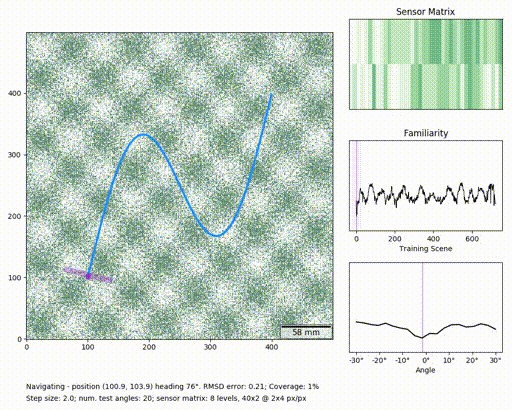

# Navigation by Déjà Vu

Simulation of the navigation-by-scene-familiarity mechanism with a local sensor. This is analogous to the scorpion's ground-sensing pectines.

## Installation

As typical for Python packages with `pip`. Installs a package named `navsim`.

Scripts for using `navsim` are in the `scripts/` directory.
